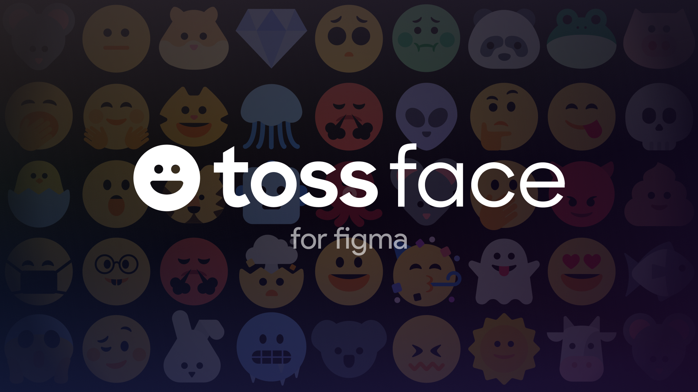
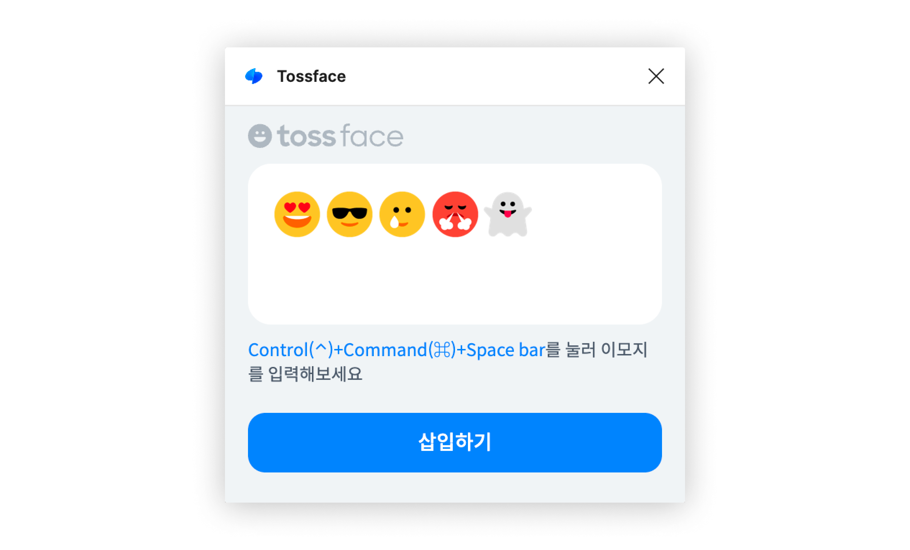

   
  Figma plugin for using <a href="https://toss.im/tossface">Tossface</a> emojis in your design
    

## Usage

Open this [Tossface plugin](https://www.figma.com/community/plugin/1315040601403942607) in your figma design file.

## Features

- [x] ⚡️ One-click emoji insertion
- [ ] 📦 Easy emoji search
- [ ] 🌐 Multi language support (Currently only Korean)

## Contributing

- Run `pnpm install` to install dependencies.
- Run `pnpm build:watch` to start webpack in watch mode.
- Open `Figma` -> `Plugins` -> `Development` -> `Import plugin from manifest...` and choose `manifest.json` file from this repo.

⭐ To change the UI of your plugin (the react code), start editing [App.tsx](./src/app/components/App.tsx).  
⭐ To interact with the Figma API edit [controller.ts](./src/plugin/controller.ts).  
⭐ Read more on the [Figma API Overview](https://www.figma.com/plugin-docs/api/api-overview/).

## Licence

> https://toss.im/tossface/copyright

All copyright of the emojis belong to Viva Republica (Toss).

Be sure to read the [Tossface licence](https://toss.im/tossface) before using the assets in your design.
